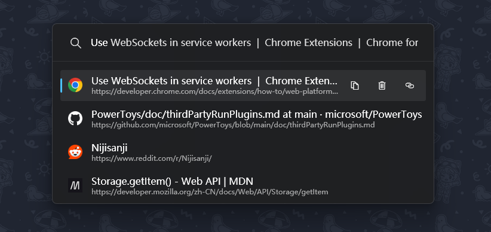

   

<h1 style="margin: 0;">TabPort</h1>
TabPort is a browser extension and PowerToys Run plugin that helps you:

- Switch tabs across different browsers
- Close tabs
- Copy tab's URL/Title

## Installation

You have two options for downloading the latest version:

**A. Recommended: Download from
the [Releases page](https://github.com/cppakko/Community.PowerToys.Run.Plugin.TabPort-Private/releases/latest).** This
is the easiest and most stable option, providing pre-built releases.

**B. For the latest development build: Download from GitHub Actions.** This option provides the most up-to-date features
and bug fixes, but may be less stable.

> [!NOTE]
> There are double level compression in the GitHub Actions artifacts. You need to extract the zip file twice to get the
> actual files.

### Browser Extension

**For Firefox Users:**

Due to Firefox's security policies, unsigned extensions cannot be installed directly. You have two options:

1. **Download the signed xpi file from the Releases page or GitHub Actions artifacts (if available) and install it.**
   This is the easiest method.
2. **Resolve the signing issue yourself.** You can temporarily install the unsigned extension or sign it with your own
   developer certificate. For more details, please refer to
   the [official Mozilla documentation](https://extensionworkshop.com/documentation/develop/temporary-installation-in-firefox/).

**For Chrome/Edge/Opera (Chromium-based browsers) Users:**

1. Enable developer mode in your browser.
2. Install the extension from the downloaded zip file.

### PowerToys Run Plugin

1. Exit PowerToys.
2. Extract the folder from the zip file to `%LOCALAPPDATA%\Microsoft\PowerToys\PowerToys Run\Plugins`.
3. Restart PowerToys and enjoy!

> [!NOTE]
> Currently, after changing the Port number in the PowerToys settings for TabPort, you need to either disable and
> re-enable the PowerToys Run or restart PowerToys entirely for the changes to take effect.

## Favicon Setting

### Favicon DB Priority

By default, the plugin will access the favicon database from these paths depending on the browser you choose:

| Browser   | Path                                                                        |
|-----------|-----------------------------------------------------------------------------|
| Chrome    | `%LOCALAPPDATA%\Google\Chrome\User Data\Default\Favicons`                   |
| Opera     | `%AppData%\Opera Software\Opera Stable\Default\Favicons`                    |
| Edge      | `%LOCALAPPDATA%\Microsoft\Edge\User Data\Default\Favicons`                  |
| Firefox\* | `%APPDATA%\Mozilla\Firefox\Profiles\[Last modifyed folder]\favicons.sqlite` |

### Custom Favicon DB Path

If the plugin can't find the favicon database from the default path, you can set a custom path in the settings.

The database layout is Chromium style (Chrome, Opera, Edge) by default, but you can change it to Firefox style by
changing the `Favicon DB Priority` to Firefox.

### Thanks

Awesome plugin template by [PowerToys Run Plugin Template](https://github.com/hlaueriksson/Community.PowerToys.Run.Plugin.Templates)